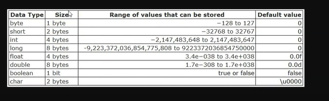

# Introdução
## Tipos primitivos:

No java existem oito tipos primitvos:
- int
- dobule
- float
- char
- byte
- short
- long
- boolean

## casting
! não é muito recomendado, pela perda de dados
transformando um long em int com o casting
int age = (int) 2600000000L;
